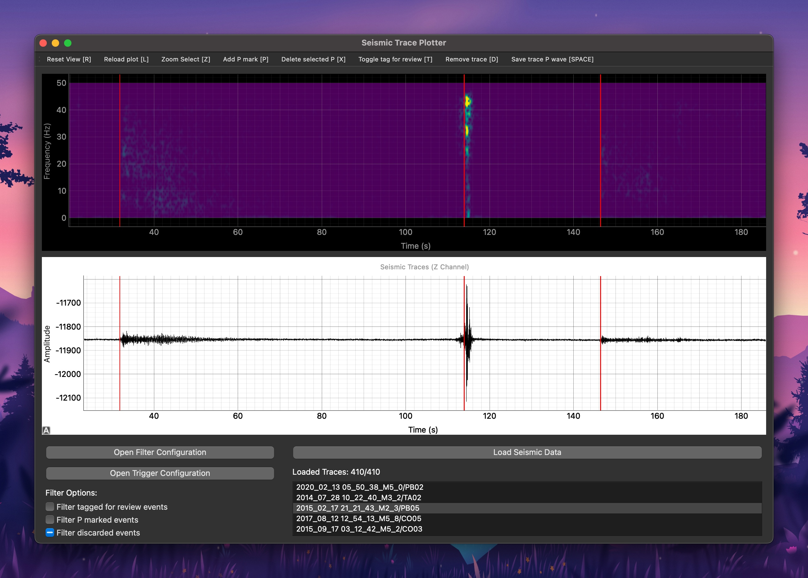

# Seismic Trace Tagging and Picking App

This is a PyQt-based application for tagging and picking seismic traces, managed with the Python `uv` package manager. The app provides an intuitive user interface for interacting with seismic data, allowing users to tag important events and manually pick seismic traces for analysis.



## Features

- **Interactive GUI**: Built with PyQt for a clean and responsive interface.
- **Tagging Seismic Events**: Add labels to seismic traces for easy identification.
- **Picking Seismic Traces**: Manually select and analyze specific seismic data points.
- **Integration with UV Package Manager**: Manage dependencies and package your app easily with `uv`.

## Requirements

- Python 3.8+
- PyQt5 or later
- UV Package Manager

### Installation

You can install the dependencies using [uv](https://docs.astral.sh/uv/getting-started/installation/):

```bash
git clone https://github.com/tomasjm/seismic-manual-picker
cd seismic-manual-picker
uv sync
uv run main.py
```
